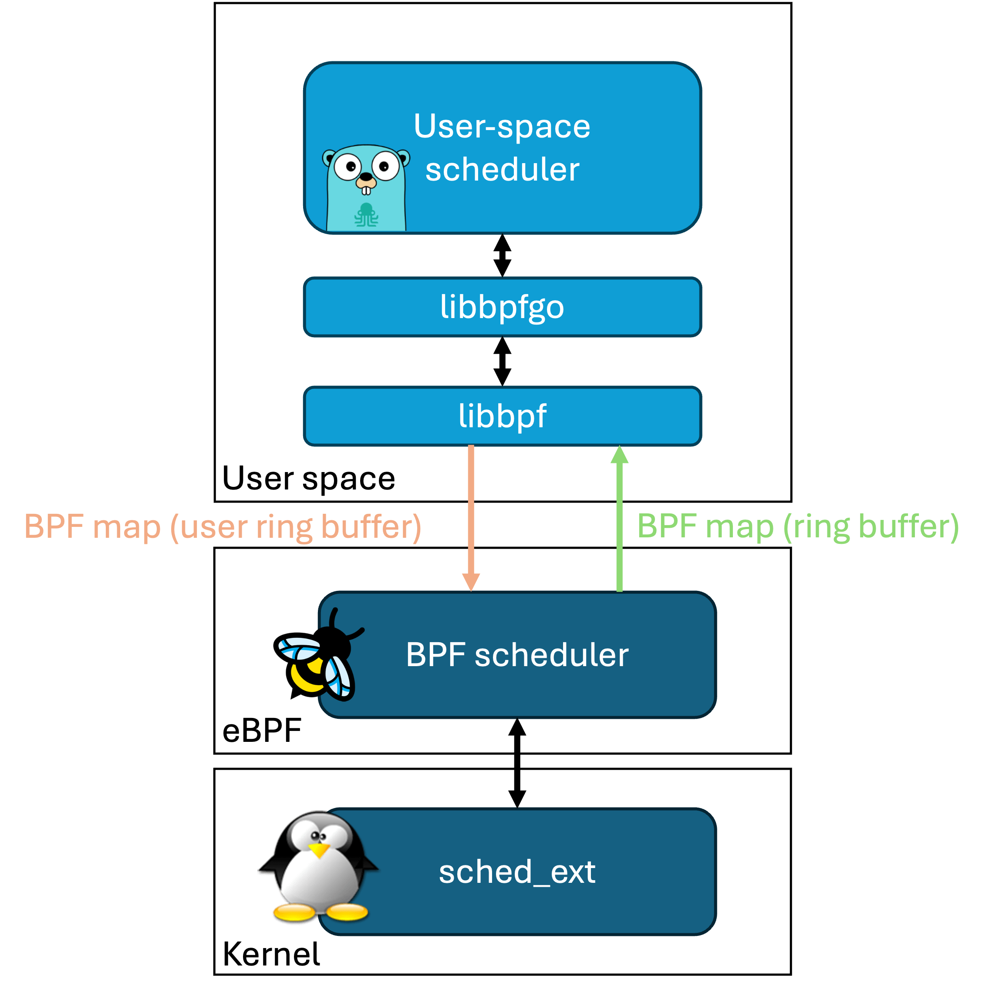

# SCX GoLand Core

A framework for building custom Linux schedulers using BPF and Go.

## Overview

This scheduler is designed to prioritize interactive workloads over background CPU-intensive tasks. It's particularly suitable for:

- Low-latency interactive applications
- Gaming
- Video conferencing
- Live streaming

The scheduler consists of two main components:
1. A BPF component that implements low-level sched-ext functionalities
2. A user-space scheduler written in Go with scx_goland_core that implements the actual scheduling policy

## Key Features

- Virtual runtime (vruntime) based scheduling
- Latency-sensitive task prioritization
- Dynamic time slice adjustment
- CPU topology aware task placement
- Automatic idle CPU selection

## How It Works

The scheduling policy is based on virtual runtime:
- Each task receives a time slice of execution (slice_ns)
- The actual execution time is adjusted based on task's static priority (weight)
- Tasks are dispatched from lowest to highest vruntime
- Latency-sensitive tasks receive priority boost based on voluntary context switches

## Building

Prerequisites:
- Go 1.19+
- LLVM/Clang 17+
- libbpf
- Linux kernel 6.12+ with sched_ext support

## License

This software is distributed under the terms of the GNU General Public License version 2.

## Contributing

Contributions are welcome! Please feel free to submit pull requests or open issues for bugs and feature requests.